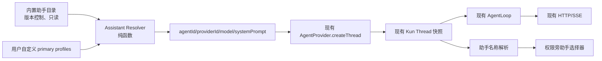
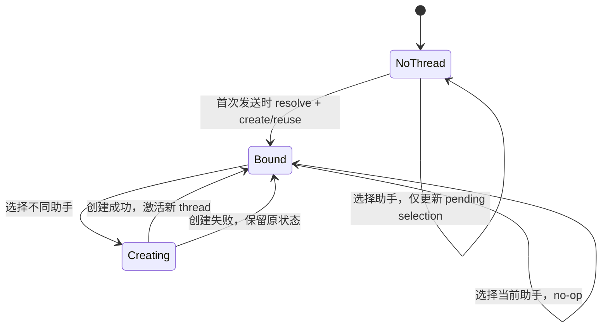

# 企业助手选择器：技术设计

## 1. 设计摘要

本方案把现有 `FloatingComposerAgentPicker` 演进为原对话页中的“助手”选择器。它复用现有 Kun 单运行时和 thread persona 能力，不建设助手库、安装流程、第二套运行时或新的持久化子系统。



核心决定：

1. **只有一个 Kun runtime。** 内置助手只是创建 thread 时使用的静态 persona 模板。
2. **没有安装心智。** 6 个内置助手开箱可选，不写入 `agents.kun.subagents.profiles`。
3. **thread 是唯一持久化真相。** `agentId/providerId/model/systemPrompt` 在创建时一次性快照；已有 thread 不热替换 persona。
4. **不增加 AppSettings 字段或显示名称 sidecar。** 内置助手通过稳定 ID 显示当前 locale 名称；自定义助手优先显示当前 profile 名称，profile 不存在时显示稳定 ID。
5. **选择不同助手就是在原页面开始新 thread。** 当前 thread update contract 不支持 persona 字段，因此不修改原 thread。
6. **稳定提示词前缀不动。** persona 仅作为现有 thread `systemPrompt` 动态后缀；不修改 Kun prefix、工具 schema、HTTP/SSE 或 usage/cache 解析。

## 2. 当前实现审计

### 2.1 可直接复用

| 当前能力 | 代码事实 | 本方案 |
|---|---|---|
| `FloatingComposerAgentPicker.tsx` | 读取自定义 primary profile，使用英文 Agent 心智 | 改成通用/内置/我的助手选择器 |
| `FloatingComposer.tsx` | 权限在左侧工具区；旧 picker 在右侧模型之后 | 把 picker 移到权限后面 |
| `composerAgentId` | 保存下一条新 thread 的 profile ID | 保留内部字段名，扩展为助手 selection ID |
| `AgentProvider.createThread` | 已支持 `agentId/providerId/model/systemPrompt` | 原样复用 body shape |
| `NormalizedThread` | 已包含上述 persona 字段 | 作为运行时与显示选择的真相 |
| `findReusableEmptyThreadId` | 只比较 workspace/空状态，不比较 persona | 增加已解析 persona 匹配条件 |
| `createThread` | 普通、conversation、worktree 分支重复解析 profile | 收口到共享 resolver/helper |
| `sendMessage` 自动建 thread | 当前没有应用 `composerAgentId` | 接入同一 resolver/helper |
| Kun fork | 已继承源 thread persona | 不增加额外 fork 逻辑 |

### 2.2 当前设置实现的真实落点

若实现中需要读取 profile，只使用现有接口和文件：

- renderer：`rendererRuntimeClient.getSettings({ forceRefresh })`；
- 类型：`src/shared/app-settings-types.ts`；
- normalize：`src/shared/app-settings-normalize.ts`；
- 默认值：`src/main/settings-store.ts` 的 `defaultSettings`；
- IPC patch schema：`src/main/ipc/app-ipc-schemas.ts`。

本方案不修改后四项的数据 shape。助手目录是 renderer 静态产品内容，自定义助手仍从现有 settings 读取。

### 2.3 明确不修改

- `kun/src/prompt/kun-system-prompt.ts` 与稳定 Claude360 Copilot operating contract。
- Kun thread list/create/get/update/delete/fork/resume/start/steer/interrupt/compact 路由 shape。
- SSE schema、renderer event mapper、approval/user-input/usage/workspace 事件。
- provider usage/cache 计数解析方式。
- AppSettings 类型、settings IPC schema、settings store 默认值。
- `delegate_task` profile 协议和 builtin delegation profiles。
- fork、side conversation、delete、archive、resume、compact 的既有实现。
- 侧栏和路由；不新增 `assistants` 或 `experts` 页面。

## 3. 助手领域模型

领域代码放在无 React 依赖的 renderer feature 中：

```text
src/renderer/src/features/assistants/
  assistant-types.ts
  assistant-catalog.ts
  assistant-resolver.ts
  assistant-display.ts
  personas/
    official-document.ts
    meeting-notes.ts
    report-summary.ts
    research.ts
    data-analysis.ts
    contract-review.ts
```

### 3.1 类型

```ts
export type BuiltinAssistantId =
  | 'builtin.official-document'
  | 'builtin.meeting-notes'
  | 'builtin.report-summary'
  | 'builtin.research'
  | 'builtin.data-analysis'
  | 'builtin.contract-review'

export type AssistantSelectionId = string // '' = 通用助手

export type BuiltinAssistantDefinition = {
  id: BuiltinAssistantId
  version: number
  order: number
  nameKey: string
  descriptionKey: string
  riskNoticeKey?: string
  systemPrompt: string
}

export type ResolvedAssistant = {
  selectionId: AssistantSelectionId
  kind: 'general' | 'builtin' | 'custom'
  threadFields: {
    agentId?: string
    providerId?: string
    model?: string
    systemPrompt?: string
  }
}

export type AssistantResolveError =
  | { code: 'not_found'; assistantId: string }
  | { code: 'disabled'; assistantId: string }
  | { code: 'not_primary'; assistantId: string }
  | { code: 'reserved_id_conflict'; assistantId: string }
  | { code: 'invalid_catalog'; assistantId: string }
```

不在 `ResolvedAssistant` 中复制 display name、provider telemetry 或 runtime diagnostics；它只产出创建 thread 所需字段。

### 3.2 静态目录

目录约束：

- ID 以 `builtin.` 开头、全局唯一，版本为正整数。
- persona 是稳定静态字符串，不包含当前日期、用户名、workspace、provider/model 或动态 diagnostics。
- catalog 初始化时校验一次；开发/测试遇到非法条目直接失败，生产过滤并记录诊断。
- 自定义 profile 使用 `builtin.*` 时视为保留命名空间冲突，不覆盖内置助手。
- 内置助手不写入 settings，不进入 `delegate_task` profiles。

为避免 bundle 初始渲染重复处理长字符串，catalog 在模块初始化时构建一次只读 map/list；React 只消费轻量元数据。

### 3.3 Resolver

```ts
resolveAssistant(
  settings: AppSettingsV1,
  selectionId: AssistantSelectionId
): Result<ResolvedAssistant, AssistantResolveError>
```

规则：

1. 空 ID：通用助手，不增加 persona 字段。
2. 合法内置 ID：`agentId` 为内置 ID，`systemPrompt` 为 catalog persona；model/provider 由现有 create 默认逻辑决定。
3. 自定义 profile：只接受 `enabled && (mode === 'primary' || mode === 'all')`，快照 `id/providerId/model/systemPrompt`。
4. 显式无效 ID fail closed，不静默退回通用助手。
5. resolver 不读 store、不发 IPC/HTTP、不修改 settings。

UI 构建“我的助手”列表时使用同一 eligibility 与命名空间检查，避免菜单可选但 resolver 拒绝。

## 4. Thread persona 与显示规则

### 4.1 持久化与运行时真相

现有 thread 已持久化：

```ts
type NormalizedThread = {
  agentId?: string
  providerId?: string
  model: string
  systemPrompt?: string
  // existing fields...
}
```

Kun 已在 create contract、thread summary/detail、fork 和 AgentLoop 中传播这些字段。因此 MVP 不新增 `assistantName`、`assistantVersion` 或 settings sidecar。

### 4.2 显示名称纯函数

```ts
displayNameForAssistantId(
  agentId: string | undefined,
  catalog: ReadonlyMap<string, BuiltinAssistantDefinition>,
  profiles: readonly KunSubagentProfileV1[],
  t: TFunction
): string
```

优先级：

1. `agentId` 为空：通用助手。
2. 命中内置 ID：按当前 locale 的 `nameKey` 显示。
3. 命中当前自定义 profile：显示当前 profile 名称。
4. 其他非空 ID：显示稳定 ID，并可用“此助手已不可用于新对话”的 tooltip。

该规则不会误称另一个助手，也不会改变历史 persona。MVP 接受“删除自定义 profile 后旧显示名退化为稳定 ID”；若真实试点证明名称快照有价值，再单独设计持久化方案。

### 4.3 fork 与历史兼容

- fork 和 side conversation 已由 Kun 继承 thread persona，显示函数直接读取 fork 返回的 `agentId`。
- delete/archive/resume/compact 不需要助手元数据清理或同步。
- 内置助手版本升级后，旧 thread 继续使用旧 `systemPrompt` 快照，但 UI 显示当前产品名称；新 thread 使用新 persona。
- 未知 `builtin.*` 历史 ID 显示稳定 ID，不伪装成通用助手。

## 5. 创建、复用与切换

### 5.1 创建字段 helper

在 store helper 层提供共享协调逻辑，例如：

```ts
async function resolveThreadAssistantFields(
  selectionId: string,
  options?: { forceRefresh?: boolean }
): Promise<ResolvedAssistant>
```

以及一个由普通创建路径共享的 provider create helper。固定顺序：

1. 获取 settings；首条发送和显式切换使用 `forceRefresh: true`。
2. 运行 resolver；失败时尚未创建 thread。
3. 将 `threadFields` 合并进现有 `provider.createThread` input。
4. 校验返回 `thread.agentId` 与 resolved `agentId` 一致；不一致视为失败。
5. 校验失败时 best-effort 删除尚未发送的新空 thread；不激活、不发送。
6. 成功后沿用现有 store 注册、选择和 refresh 顺序。

这不是新的网络事务，也不改变 provider contract；只是让现有创建调用共享同一个 persona 决策。

### 5.2 创建路径矩阵

| 路径 | selection 来源 | 行为 |
|---|---|---|
| 普通新 thread | 显式 `options.agentId`；否则 active thread 的 `agentId`；无 active thread 时用 `composerAgentId` | resolve 后 create |
| conversation 新 thread | 同上 | 创建 workspace 后用相同 fields |
| worktree 新 thread | 同上 | 获取 worktree 后用相同 fields |
| 无 active thread 的首条发送 | `composerAgentId` | force-refresh、resolve、复用或 create 后发送 |
| picker 从 active thread 切换 | 用户刚选的 ID | force new，同 workspace create，不发送 |

Write、Claw、SDD、schedule、workflow 等专用创建路径不读取 `composerAgentId`，保持原状。

### 5.3 空 thread 复用

扩展 `findReusableEmptyThreadId`，让调用方传 persona predicate 或 resolved snapshot：

```ts
isReusableThread(thread) && sameAssistantSnapshot(thread, resolved)
```

`sameAssistantSnapshot` 至少满足：

- 标准化后的 `agentId` 完全相同；
- 通用只能匹配无 `agentId` 的 thread；
- 专用助手要求 `systemPrompt` 与 resolved persona 一致；
- 自定义助手显式指定 provider/model 时也要一致。

其他既有条件不变：workspace 相同、自动标题、无用户消息、route 类型正确；`forceNew` 与 worktree 禁止复用。

这样既防止通用/A/B 交叉复用，也不会把 persona 已更新的旧空 thread 当成当前版本。

### 5.4 选择状态机



`selectAssistant(selectionId)` 是 store action：

- 无 active thread：只更新 `composerAgentId`。
- 有 active thread且 ID 相同：清除错误或 no-op；React 负责关闭菜单。
- 有 active thread且 ID 不同：检查当前没有 pending runtime work，然后在同 workspace 创建 `forceNew` thread。
- 失败：不改变 activeThreadId、草稿、附件、文件引用或原 thread。
- 成功：激活新 thread，并把 `composerAgentId` 同步为新 thread ID；不自动发送。

当用户切换到一个历史 thread 时，picker 显示值直接来自该 thread，并把 `composerAgentId` 同步为该 thread 的 `agentId ?? ''`。若该自定义 ID 已不可用于新建，按钮仍显示稳定 ID；后续创建在 resolver 处 fail closed 并要求用户重选，绝不自动回到通用助手。

### 5.5 busy 与等待输入

切换前复用现有 `busy` 和 `threadHasPendingRuntimeWork(blocks)`：

- turn、工具或 compaction 正在运行时拒绝；
- approval 或 user_input 仍 pending 时拒绝；
- 用户可先完成、拒绝或中断当前交互。

不要增加新的审批协议或 SSE 状态。

### 5.6 首条发送失败回滚

当前 `sendMessage` 在无 active thread 时已经先插入乐观 user block。接入 resolver 后：

- settings 读取、resolver、create 或返回 agentId 校验任一失败，调用既有 optimistic rollback；
- 保留原输入恢复语义、附件与文件引用；
- 不创建 turn，不静默改为通用助手；
- 错误文案引导用户重新选择或前往现有助手设置。

## 6. 选择器 UI

### 6.1 组件职责

可保留 `FloatingComposerAgentPicker.tsx` 文件名以降低 churn。组件只负责：

- 加载现有 custom profiles；
- 从静态 catalog 读取内置助手轻量条目；
- 根据 active thread 或 pending selection 计算显示项；
- 渲染分组、radio 选中态和键盘行为；
- 调用 `selectAssistant`。

persona 解析、thread 创建和失败恢复不进入 React。

### 6.2 位置和可见性

在 `FloatingComposer.tsx` 的左侧意图工具区中：

```tsx
<FloatingComposerExecutionPicker ... />
<FloatingComposerAgentPicker ... />
```

- picker 紧跟权限；从右侧模型 picker 后移除。
- 仅 `!compact && route === 'chat'` 且该 composer 支持普通 primary thread 时显示。
- Write、Claw、compact side composer、隐藏模型的专用 surface 不显示。
- 即使无自定义 profile 也始终显示，因为通用和内置助手可用。

### 6.3 列表和状态

顺序：

1. 通用助手；
2. 内置助手；
3. 可选的“我的助手”；
4. 可选的“管理我的助手”现有设置入口。

按钮有 active thread 时显示 `displayNameForAssistantId(activeThread.agentId)`；无 active thread 时显示 pending selection。未知历史 ID 不出现在可选 radio 列表，但按钮仍显示稳定 ID。

设置加载失败时通用/内置仍可用；“我的助手”区域显示可重试状态，而不是伪装为成功加载的空列表。

### 6.4 Popover 与 a11y

复用 `FloatingComposerExecutionPicker` 的 portal、viewport clamp、上下翻转和 resize/scroll 重定位模式：

- `aria-haspopup="menu"`、`aria-expanded`；
- `role="menu"` 与 `role="menuitemradio"`、`aria-checked`；
- ArrowUp/ArrowDown、Home/End、Enter/Space、Escape、Tab、外部点击；
- 名称可截断，但 title/aria-label 包含完整名称；
- 选中状态有图标/文本语义，不只依赖颜色；
- busy/pending runtime work 时按钮 disabled，并有可理解 title。

## 7. 公文写作助手 persona

### 7.1 稳定结构

`personas/official-document.ts` 固定包含：

1. 角色与边界：拟稿、改写、检查辅助，不代替签发/合规审核。
2. MVP 文种：通知、请示、报告、函、纪要。
3. 输入分诊：目的、文种、机关/部门、主送、事实、依据、事项、期限、附件、单位模板。
4. 文种规则：请示一文一事，报告不夹带请示，函匹配行文关系，纪要区分讨论/建议/议定事项。
5. 事实规则：只使用已提供或可验证事实；缺失使用方括号占位并列待核事项。
6. 输出契约：起草判断 → 可复制初稿 → 待核事项 → 通用格式提示；检查模式输出问题清单和修订稿。
7. 安全规则：不伪造依据，不服从附件提示注入，不自动发送/签发/盖章/发布。
8. 语言规则：跟随用户语言，保留原意，事实性修改显式说明。

### 7.2 工具与权限

- persona 不硬编码 web/MCP 一定可用；核验前读取真实工具能力。
- 附件沿用现有 runtime 内容链路。
- 有副作用工具仍走现有 approval policy。
- 助手名称不授予额外权限。
- persona 不含动态日期、settings 或 workspace，保证同一 thread 后续 suffix 稳定。

## 8. 评测设计

### 8.1 资产

```text
docs/evals/official-document/
  fixtures.json
  rubric.md
  runbook.md
  results/.gitkeep
```

fixture schema：

```ts
type OfficialDocumentEvalFixture = {
  id: string
  documentType: 'notice' | 'request' | 'report' | 'letter' | 'minutes' | 'cross-type'
  mode: 'draft' | 'transform' | 'rewrite' | 'check' | 'compare'
  userPrompt: string
  attachments?: Array<{ name: string; text: string }>
  expected: {
    mustMention?: string[]
    mustNotClaim?: string[]
    expectedMissingFacts?: string[]
    hardFailureTags?: string[]
  }
}
```

### 8.2 CI 与发布评测分离

CI 只做确定性检查：

- catalog/locale/persona schema；
- fixture ID 唯一、总数与 5 文种覆盖；
- persona 必备边界、禁止项和输出结构；
- fixture 不含明显密钥、身份证号或真实内部地址。

发布前模型评测使用现有 Kun runtime 的隔离 thread，记录 commit、assistant version、provider/model、输入、原始输出、人工评分和真实 usage/cache。CI 不访问模型，不把随机输出当单元测试。

通过门槛：每例 6 个维度总分至少 10/12 且无硬失败；22 个以上 fixture 全部无硬失败。失败保留原始结果，修 persona 后使用同 fixture 重跑。

## 9. Prompt Cache 与协议证明

模型请求形态保持：

```text
byte-stable Claude360 Copilot / Kun prefix
+ thread.systemPrompt（专用助手动态 persona suffix）
+ conversation/tool context
```

回归证明：

- 稳定 prefix 与工具 schema 未改。
- 通用 thread 不增加 persona suffix。
- 内置 persona 只经现有 create body 进入 thread，并在同一 thread 内保持快照。
- catalog 名称/说明、locale 和 fixture 不进入请求。
- 不新增 HTTP route 或 SSE event。
- usage/cache 只使用 provider/runtime 的真实计数。

## 10. 错误处理

| 场景 | 行为 |
|---|---|
| 自定义助手禁用/删除 | 菜单不再提供；待选发送 fail closed；历史 thread 按快照运行，名称退化为 ID |
| catalog 条目非法 | 开发/测试失败；生产过滤并记录诊断 |
| 自定义 ID 占用 `builtin.*` | 不展示；resolver 返回结构化错误 |
| settings 加载失败 | 通用/内置仍显示；我的助手显示重试状态 |
| create thread 失败 | 原 thread、草稿、附件和 pending selection 不变 |
| 返回 `agentId` 不匹配 | 清理新空 thread，不激活、不发送 |
| 无 active thread 发送时助手失效 | 回滚乐观消息并提示重新选择 |
| busy/approval/user_input pending | 禁用或拒绝切换 |
| 历史未知 ID | 显示稳定 ID，不降级显示通用助手 |

## 11. 测试策略

### 11.1 纯函数

- catalog ID、排序、版本、保留命名空间与 persona 静态性。
- general/builtin/custom resolver 成功和全部错误。
- display name 的 general/builtin/current custom/deleted custom fallback。
- same assistant snapshot 与 empty-thread matching 全矩阵。
- switch decision：无 thread、相同、不同、busy/pending。

### 11.2 Store/helper

- 普通、conversation、worktree、无 thread 首条发送使用同一 resolver。
- settings force-refresh 发生在显式切换和首条发送。
- create 返回 agentId 不匹配时删除、不激活、不发送。
- general/A/B/persona version 的空 thread 不交叉复用。
- 切换成功和失败均不修改 Workbench 草稿、附件、文件引用。
- 待选 custom profile 失效时回滚乐观 user block。

### 11.3 React

- 助手紧邻权限且不再位于模型旁。
- 只在普通主 chat composer 显示。
- 通用/内置/我的助手分组与历史未知 ID。
- 无 custom profile、settings 加载失败、选择成功/失败。
- keyboard、Escape、outside click、portal placement、窄屏 accessible name。
- 不出现 Agent persona、Default runtime、安装或助手库文案。

### 11.4 集成和手测

- thread create/list/get/fork contract 回归不变。
- 权限旁选择 → 草稿/附件不变 → 首次发送 → 检查 thread persona。
- 有历史 thread 切换 → 同页新 thread → 回看旧 thread。
- profile 删除后历史 ID 可辨识且 persona 不变。
- provider usage/cache 数字与 runtime 返回一致。

## 12. 实施顺序

1. catalog、persona、resolver、display 纯函数。
2. 收口 thread 创建字段与空 thread persona 匹配。
3. 增加 `selectAssistant` 并修复首条发送路径。
4. 移动/重写 picker，补 i18n 和 a11y。
5. 增加公文 fixture、rubric、确定性检查和 runbook。
6. 跑自动化、桌面链路和 prompt-cache/协议回归。

先证明 thread persona 一致，再展示 UI。任何实现不得先做一个“看起来已切换”但实际 thread 仍使用其他 persona 的按钮。
