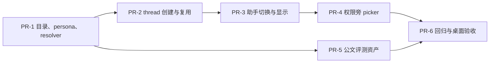

# 企业助手选择器：研发任务分解

> 本文件只拆分 MVP 实施任务。所有任务以 `requirements.md` 和 `design.md` 为准；不得在实施中重新引入独立助手库、安装流程、第二套 runtime 或历史名称 sidecar。

## 执行原则

- **用户可见统一称“助手”。** `composerAgentId`、`FloatingComposerAgentPicker.tsx` 等内部名称可保留以减少改动，但 UI 不再出现“专家”“Agent persona”“Default runtime”等旧心智。
- **thread 是唯一持久化真相。** 实际 persona 只由 `agentId/providerId/model/systemPrompt` 的创建时快照决定。
- **Kun 单运行时且不扩展设置与协议。** 仍使用现有 Kun 单运行时；不增加 AppSettings 字段、不修改 settings IPC schema、不修改 thread HTTP/SSE shape、不新增 renderer runtime。
- **不做历史名称持久化。** 内置助手按稳定 ID 显示 locale 名称；已删除的自定义助手退化显示稳定 ID，仍按 thread 快照运行。
- **先修一致性，再展示 UI。** 在创建、复用和首条发送路径可证明正确前，不合入只改变按钮外观的实现。
- **稳定前缀字节不变。** persona 只进入新 thread 的现有动态 `systemPrompt` 字段；菜单、目录说明和评测 fixture 不进入请求。

## PR 依赖总览

---

- [x] 1. 建立助手目录、persona 与解析器（PR-1，P0，1–1.5 天）
  - [x] 1.1 定义最小领域类型
    - 新增：`src/renderer/src/features/assistants/assistant-types.ts`。
    - 定义 `BuiltinAssistantDefinition`、`AssistantSelectionId`、`ResolvedAssistant` 和结构化 `AssistantResolveError`。
    - 空字符串继续代表“通用助手”；内置 ID 固定使用 `builtin.*` 保留命名空间；ID 与显示名称严格分离。
    - 不定义 thread 显示快照、安装状态、远程目录 DTO 或 AppSettings patch。
    - _Requirements: FR-1, FR-2, NFR-1_
  - [x] 1.2 建立只读内置助手目录
    - 新增：`src/renderer/src/features/assistants/assistant-catalog.ts` 与 `personas/` 下 6 个稳定静态 persona 文件。
    - 首发 ID：`builtin.official-document`、`builtin.meeting-notes`、`builtin.report-summary`、`builtin.research`、`builtin.data-analysis`、`builtin.contract-review`。
    - 每项只保存稳定 ID、版本、排序、locale key、风险提示 key 和 `systemPrompt`；不得包含日期、用户、workspace、provider/model 或实时 capability。
    - 校验唯一 ID、`builtin.` 前缀、正版本、非空 persona 和 locale key；开发/测试失败，生产排除坏条目并记录诊断。
    - _Requirements: 2.2, FR-1, NFR-3_
  - [x] 1.3 完成公文写作 persona 第一版
    - 覆盖通知、请示、报告、函、纪要的起草、材料转换、规范改写、检查和版本比较。
    - 固定包含：输入分诊、文种边界、事实忠实、缺口占位、输出契约、附件提示注入防护、禁止自动发送/签发/盖章/发布。
    - 对文号、机关、政策依据、领导姓名、日期、数据等未核事实使用“待核”或方括号占位，不得生成拟真值。
    - 其他 5 个 persona 至少明确任务目标、默认产物、事实边界和权限不扩张；不要伪装真实连接器能力。
    - _Requirements: 4.1–4.4, FR-6_
  - [x] 1.4 实现纯函数 resolver
    - 新增：`src/renderer/src/features/assistants/assistant-resolver.ts`。
    - `''` 解析为无额外 persona 字段；内置助手解析为稳定 `agentId + systemPrompt`；自定义 profile 仅接受 `enabled && mode in {primary, all}`，快照其 `id/providerId/model/systemPrompt`。
    - 显式无效、禁用、非 primary 或占用 `builtin.*` 的自定义 ID 返回结构化错误，不静默退回通用助手。
    - resolver 不依赖 React、不读写 IPC、不发 HTTP、不修改 settings。
    - _Requirements: FR-2, FR-4, NFR-3_
  - [x] 1.5 补目录、persona 与 resolver 测试
    - 新增对应 `*.test.ts`，覆盖 general/builtin/custom 成功路径、保留命名空间冲突、禁用/删除/非 primary、排序与坏目录项。
    - 断言内置 ID 不出现在 Kun delegation builtin profiles，且本 PR 不修改 `delegate_task` schema/工具定义。
    - 断言 persona 不含明显动态占位插值、安装语义或额外权限承诺。
    - _Exit gate: 纯函数测试通过；`git diff` 不含 AppSettings、IPC、thread contract 或稳定 prefix 改动。_

- [x] 2. 收口 thread 创建与空 thread 复用（PR-2，P0，1.5–2 天）
  - [x] 2.1 提取统一创建字段 helper
    - 优先新增在 `src/renderer/src/store/chat-store-thread-action-helpers.ts` 或相邻无 React helper；避免另建大 service 层。
    - 输入为 settings 与 selection ID，内部调用 resolver，输出可直接展开到现有 `AgentProvider.createThread` 的 `agentId/providerId/model/systemPrompt` 字段。
    - create 返回后校验 requested/actual `agentId`：通用要求空值，专用助手要求精确相等；不一致时 best-effort 删除新空 thread 并返回错误。
    - provider/model/systemPrompt 是否由 backend 原样快照由现有 contract/store 测试证明；不扩展 HTTP body。
    - _Requirements: FR-2, FR-4, NFR-1_
  - [x] 2.2 改造 `createThread` 的三条显式创建分支
    - 修改：`src/renderer/src/store/chat-store-thread-actions.ts`。
    - 普通 workspace、`conversation: true`、worktree pool 三条路径都读取相同 selection、调用相同 resolver/helper，删除重复的 profile 查找和静默降级逻辑。
    - selection 优先级固定为：显式 `options.agentId` → active thread 的 `agentId` → 无 active thread 时的 `composerAgentId`；ID 无效则不创建、不激活，并保留原 thread/草稿/附件。
    - worktree 创建失败或 persona 校验失败时沿用现有资源清理策略，不留下被错误激活的 thread。
    - _Requirements: 3.3A–C, FR-4, FR-5_
  - [x] 2.3 修复无 active thread 的首条发送
    - 修改：`sendMessage` 自动创建分支，确保它不再绕过 `composerAgentId`。
    - 发送前 force-refresh settings 并重新解析待选自定义助手，防止菜单选择后 profile 已被删除/禁用。
    - 新 thread 通过 persona 校验后才写入 `activeThreadId` 并发送 turn；解析/创建/校验失败时完整回滚 optimistic user block，不发送到通用 thread。
    - 继续保持 Claude360 key ensure、checkpoint、模型选择和自动标题的原有顺序语义；不要借机重写整个发送函数。
    - _Requirements: 3.3A, 3.3E, FR-4, FR-5_
  - [x] 2.4 让空 thread 复用比较助手身份
    - 扩展 `findReusableEmptyThreadId` 的参数或 predicate，比较 requested persona 与 candidate thread 的创建时快照。
    - 通用只能复用无 `agentId` 的空 thread；A 只能复用 A；A/B/通用全矩阵不得交叉复用。
    - `agentId` 相同后还必须比较 persona `systemPrompt`，并比较显式 `providerId/model`；profile 或内置 persona 已更新时不得复用旧空 thread。
    - 保留 workspace、自动标题、无用户消息、Code thread、`forceNew` 和 worktree 的既有条件。
    - _Requirements: 3.3B, FR-4_
  - [x] 2.5 扩充 store/helper 回归测试
    - 修改：`chat-store-thread-actions.test.ts`、`chat-store-runtime-helpers.test.ts`，必要时补 `chat-store-thread-action-helpers.test.ts`。
    - 覆盖普通、conversation、worktree、首条发送自动创建四条路径的 general/builtin/custom 字段。
    - 覆盖无效 ID fail closed、settings 在发送前失效、返回 `agentId` 错配、清理失败不继续发送、optimistic block 回滚。
    - 覆盖空 thread A/B/通用矩阵和当前 active/candidate 两种命中路径。
    - _Exit gate: 四条创建路径共用 resolver；不存在找不到 profile 就静默创建通用 thread 的代码路径。_

- [x] 3. 实现助手显示与原位切换 action（PR-3，P0，1 天）
  - [x] 3.1 实现显示名称纯函数
    - 新增：`src/renderer/src/features/assistants/assistant-display-name.ts` 及测试。
    - `thread.agentId` 为空显示“通用助手”；命中内置 ID 时按当前 locale key 显示；其他 ID 优先当前自定义 profile 名称，缺失时显示稳定 ID。
    - 无 active thread 时显示 `composerAgentId` 的待选名称；待选项失效时显示可诊断状态并要求重选，不能假装成通用助手。
    - 不保存创建时名称，不新增 localStorage/registry/settings sidecar。
    - _Requirements: 3.4, FR-3, NFR-1_
  - [x] 3.2 新增 `selectAssistant(selectionId)` store action
    - 修改：`chat-store-types.ts`、`chat-store-app-actions.ts` 或最贴近 thread 生命周期的现有 action module；React 组件只调用 action。
    - 无 active thread：校验 selection 后更新 `composerAgentId`，不创建 thread。
    - active thread 的 `agentId` 与 selection 相同：no-op，只清错误/关闭菜单。
    - 不同助手：在同 workspace 调用统一创建路径并强制新建；成功后激活新空 thread并同步 `composerAgentId`，不自动发送。
    - 创建/校验失败时不改变 active thread、待选值、Workbench draft、附件或文件引用。
    - _Requirements: 3.3A–D, FR-4, FR-5_
  - [x] 3.3 明确运行中与等待交互门禁
    - `busy === true` 或当前 blocks 存在 pending approval/user_input 时禁止切换，并展示现有风格的明确原因。
    - 不自动 interrupt、deny approval、cancel user input 或离开当前 thread；用户先处理/中断后再切换。
    - 门禁使用现有 `threadHasPendingRuntimeWork`/block helper，不在组件复制状态判断。
    - _Requirements: 3.3D, FR-6_
  - [x] 3.4 同步已选 thread 与 composer 的后续新建默认值
    - `selectThread` 成功后，将 `composerAgentId` 同步为该 thread 的 `agentId ?? ''`，使按钮与 active thread 一致，且“新对话”默认沿用当前助手。
    - 选择 archived、fork 或 side-derived primary thread 时仍以 thread 字段为准；不解析/重写其 systemPrompt。
    - Write、Claw、SDD 等专用创建流程不读取该选择；现有 fork/side/delete/archive/resume/compact 代码无需增加助手同步逻辑。
    - _Requirements: 3.4, FR-4, NFR-1_
  - [x] 3.5 补 action 与历史兼容测试
    - 覆盖 no thread、same assistant、different assistant、busy、pending approval、pending user input、create 失败和 agentId 错配。
    - 覆盖历史内置 ID、自定义 profile 仍存在/已删除/已禁用的显示；删除后稳定 ID 可见且 thread persona 不变。
    - 覆盖 fork 继承 persona 后无需额外元数据仍能正确显示；证明未修改 fork/delete 路径。
    - _Exit gate: UI 可见名称总能从 active thread 或明确待选状态推导，不存在第二份持久化身份。_

- [x] 4. 将 picker 移到权限旁并完成产品化交互（PR-4，P0，1–1.5 天）
  - [x] 4.1 调整 composer 布局和可见性
    - 修改：`src/renderer/src/components/chat/FloatingComposer.tsx`。
    - 将 `FloatingComposerAgentPicker` 从右侧模型选择器后移到左侧工具区，紧跟 `FloatingComposerExecutionPicker`；顺序固定为“权限 → 助手”。
    - 仅在 `!compact && route === 'chat'` 且当前 surface 支持 primary persona 时显示；Write、Claw、compact side composer 不显示。
    - picker 始终渲染，即使没有自定义 profile，因为通用助手和 6 个内置助手总是可选。
    - _Requirements: 3.1, FR-3_
  - [x] 4.2 重写 picker 展示与选择事件
    - 修改：`FloatingComposerAgentPicker.tsx`，可保留文件名。
    - 按钮显示 active thread 助手或无 thread 待选助手的完整/截断名称；窄宽度仅图标时 title/aria-label 仍含完整名称。
    - 菜单顺序：通用助手 → 内置助手 →（有数据时）我的助手 → 管理我的助手。
    - 每项显示名称、简短用途和选中态，不以 provider/model 为主信息；选择只调用 `selectAssistant`，不拼 persona、不直接调用 HTTP。
    - settings 加载失败时内置助手仍可用；“我的助手”显示可重试错误，不把失败伪装为空列表。
    - _Requirements: 3.2, FR-3, FR-6_
  - [x] 4.3 完成 popover 与可访问性
    - 复用权限菜单的 portal、viewport clamp、上下翻转、scroll/resize 重定位模式，替换旧 `absolute right-0` 越界实现。
    - 按钮提供 `aria-haspopup`、`aria-expanded` 和当前助手名；菜单使用 `menu/menuitemradio` 或等价语义及 `aria-checked`。
    - 支持 ArrowUp/ArrowDown、Home/End、Enter/Space、Escape、Tab 和外部点击；选中态不能只依赖颜色。
    - busy/pending 状态禁用时仍提供原因 tooltip/accessible description。
    - _Requirements: FR-7_
  - [x] 4.4 完成中英文文案
    - 修改现有 `locales/en/common.json`、`locales/zh/common.json`。
    - 增加通用助手、内置助手、我的助手、管理我的助手、6 个名称/描述、切换成功/失败/运行中禁止切换等文案。
    - 删除该 surface 的 `Agent persona`、`Default (runtime)`、`Applies to the next new chat` 和 `No agents available`；不得新增“安装”“助手库”“专家库”。
    - _Requirements: 1, 3.2, FR-7_
  - [x] 4.5 补组件与布局测试
    - 扩展 `FloatingComposer.test.ts`；若 picker 交互复杂，新增 `FloatingComposerAgentPicker.test.tsx`。
    - 断言权限后紧邻助手、模型旁不再有 picker、普通 chat 显示、compact/Write/Claw 不显示。
    - 覆盖分组、选中项、名称回退、settings 加载错误、键盘、Escape、outside click、portal placement 和 compact accessible name。
    - _Exit gate: 原对话页最多 3 次点击完成选择；不跳页、不自动发送、无安装心智。_

- [ ] 5. 建立公文助手评测资产（PR-5，P1，可与 PR-2～4 并行，1–1.5 天）
  - [x] 5.1 建立 fixture、rubric 与 runbook
    - 新增：`docs/evals/official-document/fixtures.json`、`rubric.md`、`runbook.md`、`results/.gitkeep`。
    - 使用合成组织、姓名和数据；每个 fixture 记录文种、模式、输入/附件、must mention、must not claim、缺失事实和硬失败标签。
    - 5 个文种各至少 3 例，并补跨文种/提示注入/事实伪造/高风险动作场景，总数不少于 22。
    - _Requirements: 4.5_
  - [x] 5.2 增加确定性检查
    - 用 Vitest 或仓库现有脚本校验 fixture schema、ID 唯一、覆盖数量、合成数据约束和 persona 必备章节/禁止项。
    - CI 不调用在线模型，不把随机输出作为普通单元测试，也不伪造 usage/cache/cost。
    - _Requirements: 4.5, NFR-3_
  - [ ] 5.3 执行发布前模型评测
    - 按 runbook 通过现有 Kun runtime 为每个 fixture 创建隔离 thread，保存 app commit、assistant ID/version、provider/model、完整输入、原始输出、人工评分和时间。
    - usage/cache/cost 只记录 provider/runtime 实际返回值；缺失写 `unavailable`，不得估算。
    - 单例要求总分 ≥10/12 且无硬失败；失败后修 persona，用相同 fixture 重跑并保留旧结果。
    - 至少由内容负责人和 1 名行政/综合管理目标用户审阅代表性结果。
    - _Exit gate: ≥22 fixture 全部无硬失败；失败历史和修订可审计。_

- [ ] 6. 完成协议、缓存和真实桌面验收（PR-6，P0，1 天）
  - [ ] 6.1 运行自动化与构建
    - 运行新增/受影响 Vitest、renderer/main typecheck、design-token 检查、Kun build 和 app build；失败必须修复或明确阻塞，不能隐藏。
    - 检查 `git diff`，确认无无关用户工作被回退。
    - _Requirements: MVP-10_
  - [ ] 6.2 证明协议与稳定前缀未变
    - 对比改动前后通用 thread 的稳定 Claude360 Copilot/Kun prefix fingerprint/fixture，要求字节不变。
    - 证明内置 persona 只通过现有 create body 的 `systemPrompt` 进入新 thread，目录名称、说明、评测资产不进入请求。
    - 证明未新增或修改 thread HTTP route、SSE normalized event、approval/user-input/usage/workspace 契约。
    - cache telemetry 继续只展示 provider/runtime 的真实 `prompt_cache_hit_tokens`、`prompt_cache_miss_tokens` 等计数。
    - _Requirements: NFR-1, NFR-2_
  - [ ] 6.3 完成桌面链路手测
    - 无 thread：权限旁选择 6 个内置助手/通用/自定义 → 输入与附件不变 → 首条发送创建正确 persona thread。
    - 空 thread：通用→A、A→B、B→通用均新建或只复用同身份空 thread，不交叉复用、不跳页。
    - 有历史 thread：选择不同助手 → 同 workspace 新空 thread → 原 thread、草稿、附件保留 → 返回旧 thread 时显示正确名称/稳定 ID。
    - 验证 busy、approval、user-input 期间不可切换；create/agentId 校验失败时不发送、不丢内容。
    - 重启后验证内置与自定义历史 thread 仍按快照运行；已删除自定义 profile 显示稳定 ID。
    - _Requirements: MVP-1–9_
  - [ ] 6.4 开展可审计种子观察
    - 面向 10–20 名内部/种子用户观察两周，不为 MVP 新建隐蔽埋点系统。
    - 记录选择耗时、首条 persona 正确率、显示/runtime 错配、草稿/附件丢失、公文事实伪造和未经确认高风险动作。
    - 上线硬门槛：显示/runtime 错配=0，草稿/附件丢失=0，已知事实伪造=0，未经确认外发/签发/发布=0。
    - 问题主要来自内容质量时优先迭代 persona/fixture，不提前建设助手商城、多运行时或复杂持久化。
    - _Exit gate: requirements 第 7 节全部有代码、测试或真实桌面证据。_

---

## PR 评审清单

每个 PR 必须回答：

1. 用户可见文案是否全部使用“助手”，且没有独立助手库、详情页、安装或商城心智？
2. 助手入口是否仍在原对话页、权限右侧，选择后不跳页、不自动发送？
3. 是否仍只有一个 Kun runtime，且没有新增助手专用 HTTP API、SSE event 或 provider？
4. 是否修改稳定 Claude360 Copilot/Kun system prefix 或工具 schema？若是，停止合并并重新设计。
5. `thread.agentId/providerId/model/systemPrompt` 是否仍是唯一持久化人格真相？
6. 是否错误增加了 AppSettings、IPC、localStorage/registry 或其他助手显示 sidecar？若是，移除。
7. 是否覆盖普通、conversation、worktree、首条消息自动创建四条路径？
8. 通用、助手 A、助手 B 的空 thread 是否严格隔离？显式无效助手是否 fail closed？
9. create/校验中间失败时，是否会激活错误 thread、丢草稿/附件或把消息发给通用助手？
10. React 是否只负责展示和 action 调用，resolver 与 thread 决策是否在纯函数/helper/store？
11. approval、user-input、usage、workspace 和 provider cache telemetry 是否保持真实且契约不变？
12. 测试、typecheck、build、桌面手测和公文模型评测分别证明了什么，尚有什么风险？

## 建议排期

| 工作日 | 工程主线 | 可并行内容工作 |
|---|---|---|
| D1 | PR-1 类型、catalog、resolver | 公文 persona 第一稿 |
| D2 | PR-1 测试；PR-2 创建 helper | 5 文种 fixture |
| D3 | PR-2 显式创建与首条发送 | 冲突/安全 fixture、rubric |
| D4 | PR-2 空 thread 与回归测试；PR-3 action | runbook、业务评审 |
| D5 | PR-3 显示/历史兼容；PR-4 picker | persona 第二轮修订 |
| D6 | PR-4 布局、popover、i18n/a11y | 确定性检查 |
| D7 | 组件测试、全量自动化 | 发布前模型评测第一轮 |
| D8 | 桌面链路、协议/cache 回归、修复 | 修 persona 并重跑 |

## MVP 完成定义

只有同时满足以下条件才可标记完成：

- 原对话 composer 的“权限”右侧可选择通用助手、6 个内置助手和合法自定义 primary 助手。
- 没有助手库/专家库 route、侧栏入口、详情页、搜索、安装、升级、购买或卸载流程。
- 无 thread、空 thread、有历史 thread 三种状态均原位切换，且草稿/附件不丢失。
- 普通、conversation、worktree、首条消息自动创建均使用统一 resolver，空 thread 不跨助手复用，无效助手不静默降级。
- UI 名称从 active thread 或明确待选状态推导；无 AppSettings/IPC/localStorage 显示 sidecar；历史 profile 删除后退化显示稳定 ID并继续按快照运行。
- 6 个内置 persona 不写入 subagent profiles、不改变 `delegate_task` schema，也不授予额外工具或权限。
- 公文写作助手的 ≥22 个 fixture 通过硬门槛，原始输出、评分和真实 usage/cache 字段可审计。
- GUI HTTP/SSE、approval、user-input、usage、workspace、thread 和 provider cache telemetry 契约无回归。
- 稳定 Claude360 Copilot/Kun prefix 字节不变；assistant persona 只存在于新 thread 动态后缀。
- 相关自动化、typecheck、Kun/app build、design-token 检查和真实桌面链路通过；任何残余风险已明确记录。
